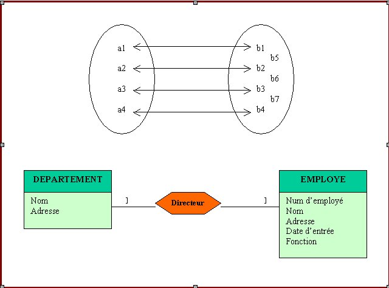
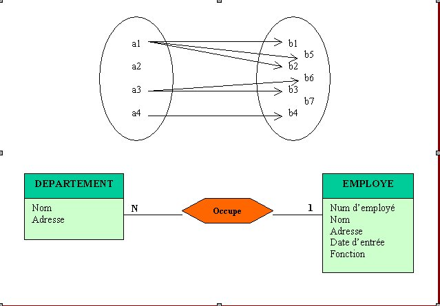
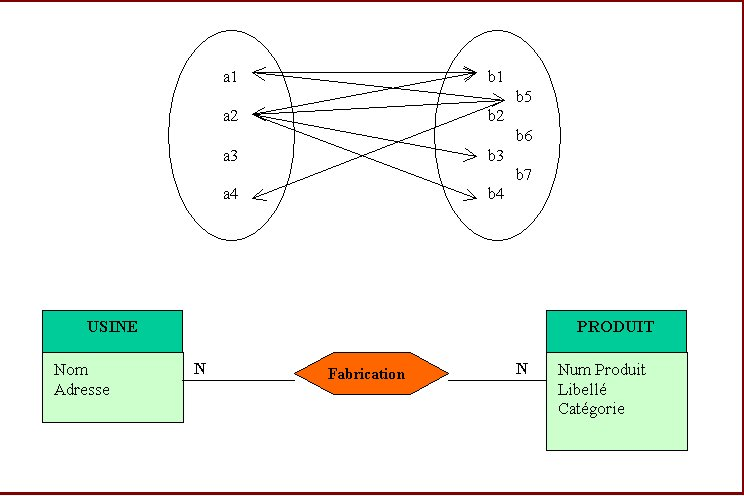
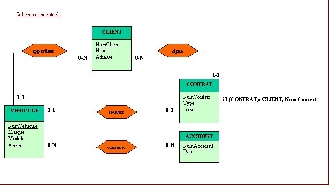
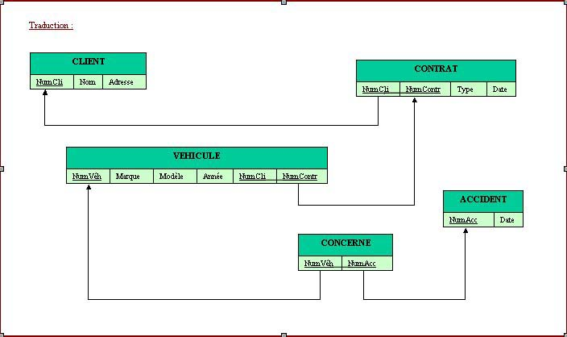

# Base de données : SQL 

## Introduction

L'objectif de cette session est d'aborder un sujet important de l'informatique.

 **la persistance des données**.

Au travers d'un des outils très utilisé : La Base de Données Relationelle ( **SGBD-R**) et son langage d'interrogation SQL

##  Agenda
1. Pourquoi, quand, où, comment sauver ses données.
2. Les SGBD: communément appelés Base de Données
3. Les Implémentations.
3. SGBD-R  les concepts : Tables, relations
4. SGBR-R le langage SQL
5. Expérimenter SQL


## Pourquoi, quand, où, comment sauver ses données.

* **Pourquoi**.
	*  Pour permettre de retrouver un état ou des informations suite à un arrêt et/ou un redémarrage d'un programme.

* **Quand**
	- Aussi souvent que nécessaire ;-), mais plutôt en fonction des besoins applicatifs.
**Notion de transaction**.

* **Où**
	* Sur un support, qui peut être, un espace mémoire, le disque local, un point dans les nuages, une base de données locale, distante...

* **Comment** 
	* Par un des mécanismes mis à disposition par votre language ou une [API](https://fr.wikipedia.org/wiki/Interface_de_programmation) disponible.

## Les SGBD : communément appelés Bases de Données.

### Concept
**SGBD** , Acronyme de **S**ytème de **G**estion de **B**ase de **D**onnées, **DBMS** en anglais.

Plusieurs besoins ont amené l'apparition des SGBD dans les entreprises.

1. Rendre transparent l'accés à une donnée en cachant la structure physique .
2. Rendre les réorganisations de structure plus simple.
3. Eviter les duplications d'information au sein des entreprises.

### Cacher la structure physique
Dans un fichier, les données sont ordonnées suivant une organisation fixe.

Par exemple un Ficher des éléves :
** Format fixe** 

1. NumID 9 caratere
2. NOM 30 caracteres,
3. PRENOM 30 caracteres,
4. Genre 1 caractere,
5. DateNaissance 8 caracteres
6. AnnéeEtude 1 cartateres.
7. Special 4caracteres
etc...

> 0- - - - 1 - - - - 2 - - - - 3 - - - - 4- - - - - - - -...
> 1234567890123456789012345678901234567890

> 000000001LAMERICAIN - - - - - - - - - -PAUL - - - - - - - - - - - - - - - M120620012INFO

> 000000002LESUISSE - - - - - - - - - - -JUILIETTE - - - - - - - - - - - -F020119991BIOL


### Format avec séparateurs

1. NumID,
2. NOM, 
3. PRENOM,
4. Genre, 
5. DateNaissance,
6. AnnéeEtude,
7. Special
etc...

> 000000001,LAMERICAIN,PAUL,M,12062001,2,INFO
000000002,LESUISSE,JUILIETTE,F,01021999,1,BIOL

Le programme doit connaitre cette organisation.

Maintenir les descriptions des structures de fichier et des programmes est un travail couteux en temps,.

Donc logiquement les organisations ont cherché des solutions pour cacher au programmeur applicatif la gestion des données sur les structures physiques.

### Rendre simple les modifications de structure 
Par ailleurs ajouter un champ nécessite soit une restructuration, soit un ajout en fin d'enregistrement. C'est à dire une tache qui peut être lourde en espace et en temps...

### Eviter les duplications d'information.
Dans une entreprise vendant du matériel et de la maintenance plusieurs services ont besoin d'information sur les acheteurs ( clients ).

1. les ventes
2. la logistique
3. l'ateier 

Chacun à besoin d'informations communes et d'informations spécifiques à son métier.

Dans les premieres années ( décénies 50-70 ) chaque service avait ses informations.
Donc assez rapidement est apparu des solutions permettant de partager les informations communes.  
Afin d'éviter une multitude modification au niveau donnée, programme etc.


### Liste de SGBD

**Document à lire** 
[Article](https://fr.wikipedia.org/wiki/Syst%C3%A8me_de_gestion_de_base_de_donn%C3%A9es
) de Wikipédia aborde 

+ les raisons de la naissance,
+ les fonctionnalités,
+ L'histoire
+ et propose une typologie 

## Implémentation.
Les premièrs SGBD sont apparus au milieu des années 60,et c'est durant cette période que les concepts ont été explorés et produits. ( IMS , OS DB comme PICK,  base Hierachique, base réseau )

IBM, G.Electric, PICK ont été les principaux acteurs de ces évolutions.

Puis ++E.F. Codd++ formalisa le concept de **Base Relationnelle** et le langage **SQL**. en 1970.

### Extrait wikipédia sur l'Histoire des bases de données.

>  Le but était de créer un dispositif informatique destiné à enregistrer les nombreuses informations en rapport avec le programme spatial, en vue de se poser sur la Lune avant la fin de la décennie. C'est dans ce but que IBM, conjointement avec Rockwell met sur le marché le logiciel Information Management System (IMS). Avec ce SGBD, les informations sont enregistrées dans des bases de données organisées de **manière hiérarchique**.

> À la même époque, General Electric, avec l'aide de Charles Bachman met sur le marché le logiciel Integrated Data Store. Avec ce SGBD les informations sont enregistrées dans des bases de données organisées selon un **modèle réseau**, ce qui permet d'enregistrer des informations ayant une organisation plus complexe que le modèle hiérarchique.

### Histoire suite
> En 1965, Dick PICK développe le système d'exploitation Pick, qui comporte un SGBD et le langage Databasic de Charles Bachman. En 2002 la technologie de Pick est utilisée dans des produits contemporains tels que JBase.

> En 1967, le consortium CODASYL forme un groupe de travail, le database task group abr. DBTG, qui travaille à la normalisation de deux langages informatique en rapport avec les bases de données: **le DML et le DDL**.

> Les organisations hiérarchiques et réseau des années 1960 manquaient d'indépendance vis-à-vis du format des fichiers, ils rendaient complexe la manipulation des données et il leur manquait une base théorique. En 1970 Edgar Frank Codd, employé de IBM publie le livre **A relational model of data for large shared data banks**, un ouvrage qui présente les fondations théoriques de l'organisation relationnelle. Sur la base des travaux de E.F Codd, IBM développe le SGBD System R, qui sera mis sur le marché à la fin des années 1970. Il est destiné à démontrer la faisabilité d'un SGBD relationnel. Le langage informatique propre à ce SGBD est le Structured Query Language (abr. SQL), défini par IBM et destiné à la manipulation des bases de données relationnelles.

> Charles Bachman reçoit le prix Turing en 1973 pour ces contributions à la technologie des bases de données et Edgar Frank Codd reçoit le prix Turing en 1981 pour les mêmes raisons.

### Les implémentations Physiques

**Relationnelles**

Depuis les années 1970 de nombreuses implémentations de SGBD ont vu le jour, surtout dans le type **SGBD-R**, les plus connues aujourd'hui étant
1. Oracle
2. SQL-Server
3. DB2
3. My-SQL ( mariaDB )
4. Postgresql
5. SQLite

Certaines ont disparu du paysage médiatique : 
Informix, Sybase, Ingres, Progress, Dbase 

**Les autres ( No-SQL )**

Elles sont Clef-Valeur (BerkleyDB. REDIS), Orientées Objets (ZODB), Documents (MongoDB), Series Temporelles (InfluxDB)

le site **sql.sh** en donne une [classification](https://sql.sh/sgbd) plus large.


A la fin des années 2000, on leur a donné le nom de base [NOSQL](https://fr.wikipedia.org/wiki/NoSQL)

Ces bases ne respectent pas la propriété ACID mais le théoreme CAP | CDP

### Propriété 
**ACID**
Les bases relationnelles respectent 4 propriétés.

* **A**tomicité : une transaction se fait au complet ou pas du tout.
* **C**ohérence : chaque transaction amènera le système d'un état valide à un autre état valide.
* **I**solation : Aucune dépendance possible entre les transactions.
* **D**urabilité : assure que lorsqu'une transaction a été confirmée, elle demeure enregistrée même à la suite d'un incident quelconque.


 **Le Théoreme CDT / CAP**
Toutes les bases ne respectent pas les contraintes suivantes.

* **C**ohérence : : tous les nœuds du système voient exactement les mêmes données au même moment.
* **D**isponibilité/**A**vailability : garantie que toutes les requêtes reçoivent une réponse.
* **T**olérance au partitionnement/**P**artitionning  : aucune panne moins importante qu'une coupure totale du réseau ne doit empêcher le système de répondre correctement.


Pour aller plus loin [**Le portail Base de données de Wikipédia**](https://fr.wikipedia.org/wiki/Portail:Bases_de_donn%C3%A9es)
Tout sur tous :-)

# Les concepts.

Nous ne parlerons dans cette présentation que de ce qui est relatif aux **SGBD-R**
## Le modèle
Le schéma conceptuel des bases relationnelles est le modèle Entité-Relation 

* Les entités
	* ce sont des éléments concrets que l'on peut identifier.
	* On peut représenter un ensemble d'entités de la réalité par une entité type.
	* Elle sont caractérisées par des attributs, un de ceux-ci est un identifiant.


* Les relations entre les entités :
    * Elles représentent les liens existant entre une ou plusieurs entités.
    * Elles sont caractérisées par un nom, une propriété d'association et éventuellement des attributs.
* Degré de relation et cardinalité
	+ Le degré de la relation est le nombre de colonnes.
	+ La cardinalité est le nombre de participation d’une entité à une relation.

Le [cours](http://tecfaetu.unige.ch/staf/staf-h/tassini/staf2x/Heidi/last_bd.htm) de Bases de Données de unige.ch est une source d'information qui a été utilisé ( graphique et quelques textes ) pour cet exposé.

## Représentation Graphique	

**Entités**


**Attributs**


### **Cardinalité un à un **


### **Cardinalité un à plusieurs **


### **Cardinalité plusieurs à plusieurs **


### Le processus de Conception

La construction d’un schéma conceptuel peut se réaliser de la manière suivante 

1.       Déterminer la liste des entités.

2.       Pour chaque entité :

	a)      établir la liste de ses attributs ;

	b)      parmi ceux-ci, déterminer un identifiant.

3.       Déterminer les relations entre les entités.

4.       Pour chaque relation :

	a)      dresser la liste des attributs propres à la relation ;

	b)      vérifier la dimension (binaire, ternaire, etc.) ;

	c)      définir les cardinalités.

5.       Vérifier le schéma obtenu, notamment :

	a)      supprimer les transitivités ;

	b)      s’assurer que le schéma est connexe ;

	c)      s’assurer qu’il répons aux demandes.

6.       Valider avec les utilisateurs.

Dans le modèle relationnel, les entités du schéma conceptuel sont transformées en tableaux à deux dimensions, nommées table ou tas.

Pour construire le schméma de base on applique au schéma conceptuel E/R des règles.

### Règle I
Toute entité est traduite en une table relationnelle dont les caractéristiques sont les suivantes :

* le nom de la table est le nom de l’entité ;
* la clé de la table est l’identifiant de l’entité ;
* les autres attributs de la table forment les autres colonnes de la table.

### Règle II

Toute relation binaire plusieurs à plusieurs est traduite en une table relationnelle dont les caractéristiques sont les suivantes :

+ le nom de la table est le nom de la relation
+ la clé de la table est formée par la concaténation des identifiants des entités participant à la relation
+ les attributs spécifiques de la relation forment les autres colonnes de la table.

Une contrainte d’intégrité référentielle est générée entre chaque colonne clé de la nouvelle table et la table d’origine de cette clé.

### Règle III

Toute relation binaire un à plusieurs est traduite :

* soit par un report de clé : 
	l’identifiant de l’entité participant à la relation côté N est ajoutée comme colonne supplémentaire à la table représentant l’autre entité. 
    Cette colonne est parfois appelée clé étrangère. 
    Le cas échéant, les attributs spécifiques à la relation sont eux aussi ajoutés à la même table ;

* soit par une table spécifique dont les caractéristiques sont les suivantes :
	*  le nom de la table est le nom de la relation ;
	*  la clé de la table est l’identifiant de l’entité participent à la relation côté 1 ;
	* les attributs spécifiques de la relation forment les autres colonnes de la table.

### Règle IV 
Toute relation binaire un à un est traduite, au choix, par l’une des trois solutions suivantes :

+ fusion des tables des entités qu’elle relie (1) ;
+ report de clé d’une table dans l’autre (2) ;
+ création d’une table spécifique reliant les clés des deux entités (3).

Les attributs spécifiques de cette relation sont 
+ ajoutés à la table résultant de la fusion (1), 
+ reportés avec la clé (2), 
+ ou insérés dans la table spécifique (3).

# Exemple de traduction de schéma conceptuel ER en modèle R en table

## Conceptuel ##


## Tables ##


# La mise en oeuvre physique.

Nous ne parlerons ici que de mise en oeuvre sur une Base Relationnelle.

C'est à ce stade que l'on va écrire les ordres **DDL** pour la base cible et pour notre cas lesinstructions SQL.

**SQL** Acronyme de *Structured Query Language*
Comme son nom l'indique c'est un langage d'intérrogation des structures d'un SGBD-R, normalisé depuis 1986 dont la dernière version est SQL:2016.

IL est déclaratif, on dit ce que l'on veut obtenir, sans dire comment.

Les instruction se répartissent en 4 domaines

## DML 
Les instructions de manipulation du contenu de la base de données commencent par les mots clés **SELECT, UPDATE, INSERT ou DELETE** qui correspondent respectivement aux opérations de recherche de contenu, modification, ajout et suppression.

### Exemples
* Sélection de données dans une table :
```SQL
select nom , marque, annee_construction from voiture;
select  * from voiture;
```

* Insertion de données dans une table :

```SQL
insert into voiture ( nom , marque, annee_construction )
Values ('DS3','Tesla',1999);
```
* Mise à jour de données dans une table :

```SQL
Update voiture set annee_construction=2019 
where nom='DS3'
  and marque='Tesla'
  and annee_construction=1999;
```
* Suppression de données dans une table :

```SQL
delete from voiture 
where nom='DS3'
  and marque='Tesla'
  and annee_construction=2019;
```


## DDL

Les instructions de manipulation des métadonnées - description de la structure, l'organisation et les caractéristiques de la base de données
commencent avec les mots-clés **CREATE, ALTER, DROP, RENAME, COMMENT ou TRUNCATE ** qui correspondent aux opérations d'ajouter, modifier, supprimer, renommer, commenter ou vider une métadonnée

### Exemples

+ Creation d'une table

```SQL

create table CONTRAT (
	NumCli    char (12)   not null,
	NumContr  char (38)   not null,
	Type      decimal (4) not null,
	Date      date        not null,
	foreign key (NumCli) references CLIENT)
;
```
+ Creation d'un index

```SQL

create index IX_CONTRAT on CONTRAT(NumCli,NumContr);
;
```
>

### LCD
Les mots clés **GRANT et REVOKE **permettent d'autoriser des opérations à certaines personnes, d'ajouter ou de supprimer des autorisations.

#### LCT
Le langage de contrôle des transactions est utilisé pour le contrôle transactionnel dans une base de données, c’est-à-dire les caractéristiques des transactions, la validation et l’annulation des modifications
Les mots clefs sont **COMMIT, SAVEPOINT, ROLLBACK, SET TRANSACTION**

> 

## SQL et algèbre relationnelle.

SQL s'appuie sur la théorie des ensembles

### Les opérations de base :

	+ La projection
		+ Cet opérateur ne porte que sur 1 relation.
```SQL
        SELECT DISTINCT Espèce FROM Champignons ;
```
	+ La sélection
		+ Cet opérateur porte sur 1 relation.
		> Il permet de ne retenir que les n-uplets répondant à une condition exprimée à l'aide des opérateurs arithmétiques ( =, >, <, >=, <=, <>) ou logiques de base (ET, OU, NON).
```SQL
        SELECT 3 FROM Champignons WHERE Catégorie="Sec";
```
	+ La Jointure
		+ En SQL, il est possible d'enchaîner plusieurs jointures dans la même instruction SELECT.
```SQL
        SELECT * FROM Produit A, Détail_Commande B 
        WHERE A.CodePrd=B.CodePrd ;
```


### Les opérations ensemblistes

	+ L’union
```SQL
     SELECT liste d'attributs FROM table1
	UNION
	SELECT liste d'attributs FROM table 2 ;
```
	+ L’intersection
```SQL
    SELECT NUMCLI FROM CONTRAT
	INTERSECT
	SELECT numcli FROM cLIENT;
```
	+ La différence
```SQL
    SELECT n°enseignant, NomEnseignant FROM E1
        WHERE n°enseignant NOT IN (SELECT n°enseignant FROM E2) ;
```
	+ Produit cartésien
```SQL
    SELECT * FROM Etudiants, Epreuves ;
```

## Aller plus loin avec SQL

Pour faire cela il faut plonger dans l'expérimentation, soit en créant sa petite base localement ou sur un serveur, soit en analysant le contenu d'une base auquelle on a accés et en utilisant tout les aspect de la commande.


SQL évolue régulièrement, se complexifie beaucoup.

La lecture des documentations de produit comme [Postgresql](https://docs.postgresql.fr/13/), [SQLite](https://www.sqlite.org/lang.html), [Mariadb](https://mariadb.com/kb/fr/faq-de-mariadb/) , [MySql](https://dev.mysql.com/doc/refman/8.0/en/sql-statements.html)  est une source d'information inépuisable. ;-)

Par exemple voici a syntaxe de l'ordre SQL en version 8.1 de postgresql compatible avec SQL:2003.

## Select : SQL:2003
> SELECT [ ALL | DISTINCT [ ON ( expression [, ...] ) ] ]
>    \* | expression [ AS nom_d_affichage ] [, ...]
    [ FROM éléments_from [, ...] ]
    [ WHERE condition ]
    [ GROUP BY expression [, ...] ]
    [ HAVING condition [, ...] ]
    [ { UNION | INTERSECT | EXCEPT } [ ALL ] select ]
    [ ORDER BY expression [ ASC | DESC | USING opérateur ] [, ...] ]
    [ LIMIT { nombre | ALL } ]
    [ OFFSET début ]
    [ FOR { UPDATE | SHARE } [ OF nom_table [, ...] ] [ NOWAIT ] ]

 > avec éléments_from qui peut être :

>   [ ONLY ] nom_table [ * ] [ [ AS ] alias [ ( alias_colonne [, ...] ) ] ]
    ( select ) [ AS ] alias [ ( alias_colonne [, ...] ) ]
    nom_fonction ( [ argument [, ...] ] ) [ AS ] alias [ ( alias_colonne [, ...] | définition_colonne [, ...] ) ]
    nom_fonction ( [ argument [, ...] ] ) AS ( définition_colonne [, ...] )
    éléments_from [ NATURAL ] type_jointure éléments_from [ ON  
    condition_jointure | USING ( colonne_jointure [, ...] ) ]

## Select SQL 2008
> [ WITH [ RECURSIVE ] requête_with [, ...] ] SELECT [ ALL | DISTINCT [ ON ( expression [, ...] ) ] ]
    [ * | expression [ [ AS ] nom_d_affichage ] [, ...] ]
    [ FROM éléments_from [, ...] ]
    [ WHERE condition ]
    [ GROUP BY element_regroupement [, ...] ]
    [ HAVING condition ]
    [ WINDOW nom_window AS ( définition_window ) [, ...] ]
    [ { UNION | INTERSECT | EXCEPT } [ ALL | DISTINCT ] select ]
    [ ORDER BY expression [ ASC | DESC | USING opérateur ] [ NULLS { FIRST | LAST } ] [, ...] ]
    [ LIMIT { nombre | ALL } ]
    [ OFFSET début ] [ ROW | ROWS ] ]
    [ FETCH { FIRST | NEXT } [ total ] { ROW | ROWS } { ONLY | WITH TIES } ]
    [ FOR { UPDATE | NO KEY UPDATE | SHARE | KEY SHARE } [ OF nom_table [, ...] ] [ NOWAIT | SKIP LOCKED ] [...] ]

> **avec éléments_from qui peut être :**
>   [ ONLY ] nom_table [ * ] [ [ AS ] alias [ ( alias_colonne [, ...] ) ] ]
                [ TABLESAMPLE methode_echantillonnage ( argument [, ...] ) [ REPEATABLE ( pourcentage_echantillon ) ] ]
    [ LATERAL ] ( select ) [ AS ] alias [ ( alias_colonne [, ...] ) ]
    nom_requête_with [ [ AS ] alias [ ( alias_colonne [, ...] ) ] ]
    [ LATERAL ] nom_fonction ( [ argument [, ...] ] )
                [ WITH ORDINALITY ] [ [ AS ] alias [ ( alias_colonne [, ...] ) ] ]
    [ LATERAL ] nom_fonction ( [ argument [, ...] ] ) [ AS ] alias ( définition_colonne [, ...] )
     [ LATERAL ] nom_fonction ( [ argument [, ...] ] ) AS ( définition_colonne [, ...] )
    [ LATERAL ] ROWS FROM( nom_fonction ( [ argument [, ...] ] ) [ AS ( définition_colonne [, ...] ) ] [, ...] )
                [ WITH ORDINALITY ] [ [ AS ] alias [ ( alias_colonne [, ...] ) ] ]
    éléments_from [ NATURAL ] type_jointure éléments_from [ ON condition_jointure | USING ( colonne_jointure [, ...] ) ]

> **et element_regroupement peut valoir :**
>    ( )
    expression
    ( expression [, ...] )
    ROLLUP ( { expression | ( expression [, ...] ) } [, ...] )
    CUBE ( { expression | ( expression [, ...] ) } [, ...] )
    GROUPING SETS ( element_regroupement [, ...] )

> **et requête_with est :**
>    nom_requête_with [ ( nom_colonne [, ...] ) ] AS [ [ NOT ] MATERIALIZED ] ( select | valeurs | insert | update | delete )
TABLE [ ONLY ] nom_table [ * ]

### Graphique 
Une autre manière d'appréhender la syntaxe  :


## Expérimenter
Pour expérimenter le SQL plusieurs voies sont possibles

### localement.
Cela demande  :
+ d'installer un serveur de SGBD.
+ de charger une base exemple.Le site [SQLITE Tutorial](https://www.sqlitetutorial.net/sqlite-sample-database/) en propose une
+ De travailler en ligne de commande.

Ou 
+ d'installer une interface graphique. comme [DB4S](https://sqlitebrowser.org/) 
  


Ou 
+ installer une interface vers le langage que vous utilisez
	+ 	python - [pysqlite](https://pypi.org/project/pysqlite/) ou [APSW](https://rogerbinns.github.io/apsw/)
	+  PHP l'extension [SQLite3](https://www.php.net/manual/en/book.sqlite3.php)


### Online.
On trouve sur internet des sites permettant d'expérimeter SQL 
en voici deux :
+ https://sqliteonline.com/
+ https://www.mycompiler.io/new/sql

### un serveur partagé

C'est une solution qui demande une mise en oeuvre lourde si vous n'avez pas accés à un serveur.
